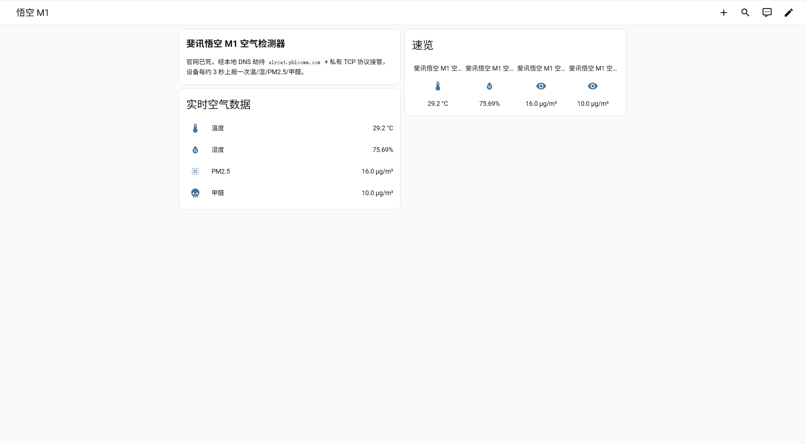
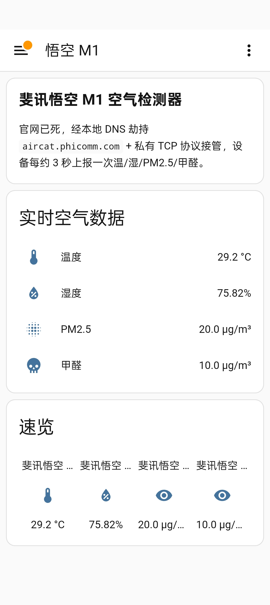
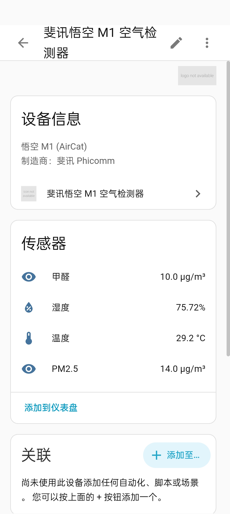
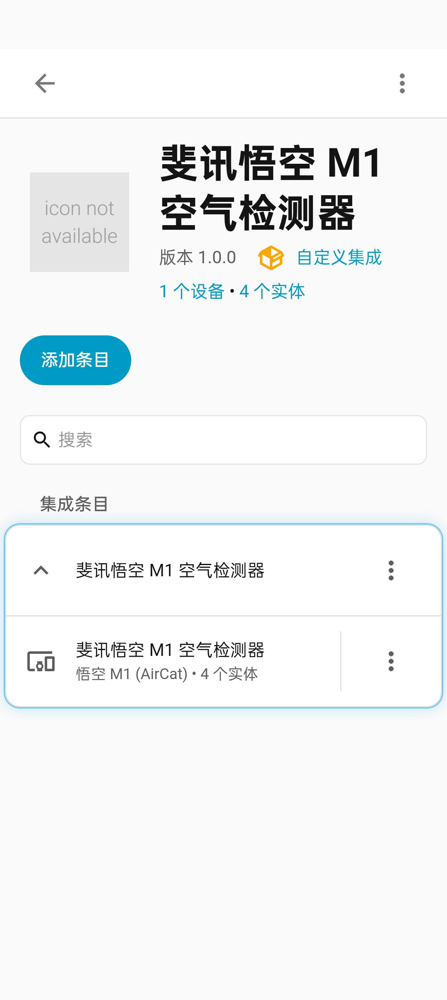

# 斐讯悟空 M1 空气检测器 · Home Assistant 本地复活集成

[]()
[]()
[]()

> **English tagline:** Local Home Assistant integration to revive the dead Phicomm Wukong M1 (AirCat) air quality monitor — no cloud, no account, pure LAN.

让你家吃灰的**斐讯悟空 M1 空气检测器**（型号 AirCat / Wukong M1，斐讯官方云 `aircat.phicomm.com` 已于 2021 年前后停服）重新活过来：通过 **DNS 劫持 + 私有 TCP 协议本地接收**，在 Home Assistant 中实时显示 **温度 / 湿度 / PM2.5 / 甲醛** 四项数据。

- ✅ 不依赖任何云服务、不需要账号密码
- ✅ 设备固件**无需刷机、无需拆机**
- ✅ 数据留在局域网内，约 3 秒一次实时上报
- ✅ **2026-09-25 实测复活成功**（Home Assistant 容器版，Python 3.13/3.14）

## 相关仓库（同一系列教程）

- [cbywyz/ha-midea-hualing-ac](https://github.com/cbywyz/ha-midea-hualing-ac) —— 美的/华凌空调云端接入教程（midea_auto_cloud）
- [cbywyz/gree-yapqf-broadlink-smartir](https://github.com/cbywyz/gree-yapqf-broadlink-smartir) —— 格力空调 Broadlink + SmartIR 红外接入教程
- [cbywyz/ha-hualing-fan-broadlink](https://github.com/cbywyz/ha-hualing-fan-broadlink) —— 华凌风扇红外接入教程（含全套遥控器编码库）

## 效果预览（2026-09-25 实拍）

**电脑端仪表盘：**



**手机端（HA Companion App）：**

| 仪表盘实时数据 | 设备信息 | 集成条目 |
|---|---|---|
|  |  |  |

> 图中数值均为真实运行数据：温度 29.2 °C / 湿度 75.8% / PM2.5 14~20 µg/m³ / 甲醛 10 µg/m³，每约 3 秒刷新。

---

## 目录

- [背景](#背景)
- [效果预览](#效果预览2026-09-25-实拍)
- [工作原理](#工作原理)
- [硬件确认](#硬件确认)
- [设备如何连 WiFi（配网教程）](#设备如何连-wifi配网教程)
- [安装步骤](#安装步骤)
  - [第 1 步：部署自定义集成](#第-1-步部署自定义集成)
  - [第 2 步：DNS 劫持](#第-2-步dns-劫持)
  - [第 3 步：添加集成并验证](#第-3-步添加集成并验证)
- [排错手册](#排错手册)
- [踩坑记录（写给二开者）](#踩坑记录写给二开者)
- [实体说明](#实体说明)
- [协议细节](docs/PROTOCOL.md)
- [致谢与参考](#致谢与参考)

---

## 背景

斐讯悟空 M1 是 2017-2018 年斐讯「0 元购」活动期间的空气检测器，外壳带屏幕和触摸按键，可检测：

| 项目 | 传感器 | 上报值示例 |
|------|--------|-----------|
| 温度 | 温湿度传感器 | `29.11` °C |
| 湿度 | 温湿度传感器 | `75.96` % |
| PM2.5 | 激光 PM2.5 传感器 | `8` µg/m³ |
| 甲醛（HCHO） | 电化学甲醛传感器 | `10` µg/m³ |

固件把数据上报到斐讯私有云 **`aircat.phicomm.com:9000`**（明文 TCP 私有二进制协议）。斐讯暴雷后官方服务器下线，设备从此「看起来正常开机、屏幕能亮，但 App 连不上、数据无处可去」。

好消息是：**固件至今仍然认这个域名并且会持续尝试上报**。所以只要把域名劫持到局域网里一台由你控制的服务器，设备就会把数据乖乖送上门。

## 工作原理

```
┌──────────────┐  ①DNS 查询 aircat.phicomm.com   ┌────────────────────┐
│  悟空 M1     │ ───────────────────────────────▶ │ 路由器 dnsmasq      │
│ 192.168.x.x  │ ◀─────────────── 返回 HA 主机 IP │ address=.../HA_IP  │
└──────┬───────┘                                  └────────────────────┘
       │
       │  ②TCP 连接 <HA_IP>:9000，每 ~3s 发一帧
       │     帧内容 = 设备头(23B) + JSON 数据 + \xff#END#
       ▼
┌─────────────────────────────────────────────┐
│  Home Assistant 自定义集成 phicomm_aircat    │
│  ③ 回 ACK 激发持续上报                        │
│  ④ 解析 JSON → 4 个 sensor 实体              │
│     温度 / 湿度 / PM2.5 / 甲醛               │
└─────────────────────────────────────────────┘
```

关键点：**服务器必须对收到的每一帧回 ACK**（帧前 23 字节 + 固定应答体），设备才会持续上报；不回 ACK 设备会一直重发。

## 硬件确认

动手前先确认你手里的是「悟空 M1」而不是斐讯其他设备：

- 外观：白色/黑色方盒，正面小彩屏，顶部触摸按键；
- App 时代的名字：斐讯 airbox / 悟空 M1 空气检测器（路由器里常见主机名 `Phicomm-AirDetector`）；
- 上报数据包含 `humidity / temperature / value(PM2.5) / hcho` 四个键（见 [协议文档](docs/PROTOCOL.md)）。

> 同时期斐讯还有 T1 音箱、DC1 插座等其他矿渣，协议不同，本仓库不涉及。

## 设备如何连 WiFi（配网教程）

> 如果你家的 M1 **已经连上过 WiFi**（路由器后台能看到它在线），直接跳到[安装步骤](#安装步骤)。这一节是给刚从闲鱼收回来、还从没配过网的设备的。

M1 官方 App 早已死亡，但它的 WiFi 配网机制不依赖 App 服务器：用的是 Marvell 芯片的 **EasyLink 广播配网**——手机在局域网里广播 WiFi 账号密码，设备在同一网段听到就自动连接。所以只需要一个本地工具（EasyLink APK）就能配网。

### 准备

| 需要 | 说明 |
|------|------|
| 悟空 M1 × 1 | 通电开机 |
| 安卓手机/平板 × 1 | 旧手机即可，全程不用插 SIM 卡 |
| **EasyLink** APK | Marvell/MXCHIP 官方配网工具。**本仓库已自带**：[`tools/EasyLink3.1.apk`](tools/EasyLink3.1.apk)（v3.1，923 KB，取自 [MXCHIP 官方 CDN](https://cdn.mxchip.com/mxchip_official_website/img/EasyLink3.1.apk)） |
| **2.4G WiFi** × 1 | ⚠️ **M1 只支持 2.4G**，连 5G 频段配不上网；双频路由器请先分开 SSID 或连 2.4G 那个 |

> 🔐 **APK 校验值**（自取官方 CDN 时的原始文件，防篡改）：
> - SHA-256：`1d9eb0860231505756964f4916a579ae0f670a244678517baef8331dd47bc6be`
> - MD5：`9da9e544bd128dfbdfca316731dc140d`
>
> ⚠️ 老旧安卓手机打开不闪退（安卓 5~10 实测友好），安卓 13+ 兼容性未验证。

### 配网步骤

1. **让设备进入配网模式**：长按 M1 机身右侧唯一的 WiFi 按键约 3 秒，直到**屏幕右上角出现带红叉的 WiFi 图标并闪烁**，松手。
2. **手机连上那个 2.4G WiFi**（手机和 M1 必须在同一网段）。
3. 打开 EasyLink，点右上角 **＋**，按下面填写：
   - **SSID**：你的 2.4G WiFi 名称（注意大小写和特殊字符要完全一致）
   - **Password**：WiFi 密码
   - **Gateway IP Address**：自动获取，不用管
   - **User Info**：留空，不用管
4. **把手机尽量凑近 M1**（半米内最好），点 **Start**。
5. 观察 M1 屏幕：右上角红色闪烁的 WiFi 图标变成**白色**即配网成功；稍等片刻屏幕上的**时间会自动同步**（说明它连上了网）。

### 配网成功的标志

- 屏幕 WiFi 图标变白；
- 屏幕日期时间自动变成当前时间；
- 路由器后台出现一台新设备，主机名通常是 **`Phicomm-AirDetector`**——**在路由器上给它做 DHCP 静态绑定**，然后就可以去做[第 2 步 DNS 劫持](#第-2-步dns-劫持)了。

### 常见配网问题

| 现象 | 处理 |
|------|------|
| EasyLink 点 Start 后设备没反应 | ① 确认手机连的是 2.4G；② 设备没进配网模式（红叉 WiFi 图标必须在闪）；③ 手机离设备太远 |
| 图标一直闪红色 | 还没连上。重新长按按键进配网模式再试；检查密码对不对 |
| 配网成功但图标一直闪烁（白色） | 正常现象，该固件就这样，不影响上报 |
| EasyLink 闪退/打不开 | 换一台安卓 7~12 的旧手机（本仓库 `tools/EasyLink3.1.apk` 即官方原包，无需再找下载源） |

> 配网只需做一次，WiFi 信息存在设备里，重启/断电后自动重连。以后换了 WiFi 名字或密码，才需要重新走一遍上面的流程。

## 安装步骤

前提：一台能装 Home Assistant 的机器（树莓派/NAS/软路由容器均可），HA 与 M1 在**同一局域网**；M1 的 IP 最好在路由器上做 DHCP 静态绑定。

### 第 1 步：部署自定义集成

把 `custom_components/phicomm_aircat/` 整个目录拷贝到 HA 配置目录下：

```
<HA配置目录>/
└── custom_components/
    └── phicomm_aircat/
        ├── __init__.py
        ├── manifest.json
        ├── const.py
        ├── config_flow.py
        └── sensor.py
```

- HA OS 用户：通过 Samba/File Editor 放入 `/config/custom_components/`；
- 容器/venv 用户：对应挂载卷里的 `custom_components/`。

然后**重启 Home Assistant**（必须重启，自定义集成不支持热加载）。

### 第 2 步：DNS 劫持

在你的路由器（或任意局域网 DNS 服务器）上，把 `aircat.phicomm.com` 解析到 **HA 主机的 IP**。

**OpenWrt / iStoreOS（LuCI 或 SSH）：**

```sh
# SSH 方式（重启后仍生效）
uci add_list dhcp.@dnsmasq[0].address='/aircat.phicomm.com/192.168.1.2'
uci commit dhcp
/etc/init.d/dnsmasq restart
```

> 把 `192.168.1.2` 换成你的 HA 主机 IP。

**通用 dnsmasq（如树莓派 adguard/pi-hole 场景）：** 在 `dnsmasq.conf` 加一行

```
address=/aircat.phicomm.com/192.168.1.2
```

**AdGuard Home：** 「过滤器 → DNS 重写」添加 `aircat.phicomm.com → <HA_IP>`。

**验证劫持生效（在路由器或任意局域网机器上）：**

```sh
nslookup aircat.phicomm.com
# 期望返回你设置的 HA 主机 IP
```

> ⚠️ 如果 HA 是 Docker **bridge 网络**部署，需把容器的 9000 端口映射出来：`-p 9000:9000`；host 网络则无需映射。

### 第 3 步：添加集成并验证

1. HA 网页 → **设置 → 设备与服务 → 添加集成** → 搜索 `phicomm_aircat`（或「悟空」）→ 点击添加（无需填写任何内容，直接提交）。
2. 等待 1~3 分钟（M1 会自动连上来），出现 4 个实体：

```
sensor.wu_kong_m1_wen_du     温度
sensor.wu_kong_m1_shi_du     湿度
sensor.wu_kong_m1_pm2_5      PM2.5
sensor.wu_kong_m1_jia_quan   甲醛
```

> 实际 entity_id 由「设备名 + 中文传感器名」slug 生成，形如
> `sensor.fei_xun_wu_kong_m1_kong_qi_jian_ce_qi_wen_du`。在「开发者工具 → 状态」里搜 `悟空` 就能找到。

3. 大功告成。之后可以随意加仪表盘卡片、自动化（比如「甲醛超标 → 推送通知」）。

## 排错手册

按顺序检查：

| 现象 | 检查 |
|------|------|
| 实体一直是 `unknown` | ① `nslookup aircat.phicomm.com` 是否返回 HA IP；② M1 是否在线（ping）；③ HA 日志有没有 `AirCat TCP server listening on 9000`；④ `ss -tlnp | grep 9000` 端口是否监听 |
| 端口没监听 | 看 HA 日志里 `phicomm_aircat` 的报错；确认 `custom_components/phicomm_aircat/` 文件齐全、重启过 HA |
| 端口监听但没数据 | 用 `tools/m1_sniff.py` 或 `tcpdump -X 'tcp port 9000'` 看设备有没有连进来；M1 拔电重插一次强制重连 |
| HA 日志报 `Address already in use` | 9000 被占用：换掉占用进程，或改 `const.py` 里的 `PORT` 并配合端口转发 |
| HA 重启后很久才有数据 | 正常。HA 启动时可能被其他集成阻塞，entry 加载会推迟 1~4 分钟，等实体出值再下结论 |

强制重连的土办法：**给 M1 断电重插**。设备开机后会立刻尝试连接 `aircat.phicomm.com:9000`。

## 踩坑记录（写给二开者）

以下是本集成为适配新版 HA（2025.x，容器内 Python 3.13/3.14）踩过的三个坑，**自己改代码时注意**：

1. **`asyncio.start_server()` 不再接受 `loop=` 参数**
   Python 3.10+ 就开始废弃，3.12+ 彻底移除。老教程里的
   `asyncio.start_server(cb, host, port, loop=hass.loop)` 会直接
   `TypeError`。删掉 `loop` 参数即可，回调本身就在事件循环里。

2. **`async_forward_entry_setups(entry, "sensor")` 传字符串会爆炸**
   第二个参数要求**可迭代对象**，传字符串会被逐字符拆成
   `['s','e','n','s','o','r']`，然后报一个迷惑性极强的
   `ModuleNotFoundError: No module named 'custom_components.xxx.s'`。
   必须传列表：`async_forward_entry_setups(entry, ["sensor"])`。

3. **不要把整帧 decode 成字符串再找帧尾**
   帧尾标记是 `\xff#END#`，其中 `0xff` 是非法 UTF-8 字节，
   `data.decode("utf-8", "ignore")` 会把它**悄悄丢掉**，导致
   `text.find("}\xff#END#")` 永远返回 -1、数据解析整个被跳过
   （而且没有任何报错！）。解析必须在**原始字节**上进行：

   ```python
   start = data.find(b"{")
   end = data.find(b"}\xff#END#")
   obj = json.loads(data[start : end + 1])   # json.loads 接受 bytes
   ```

## 实体说明

| 键（JSON） | 实体 | 单位 | 说明 |
|-----------|------|------|------|
| `temperature` | 温度 | °C | device_class=temperature |
| `humidity` | 湿度 | % | device_class=humidity |
| `value` | PM2.5 | µg/m³ | 固件原始键名就叫 value |
| `hcho` | 甲醛 | µg/m³ | 电化学传感器原始值 |

> 甲醛数值的标定精度未经专业仪器校验，趋势参考为主。

## 致谢与参考

- [hassbian 论坛帖：斐讯悟空 M1 本地接管（DNS 劫持思路来源）](https://bbs.hassbian.com/thread-2400-1-1.html)
- [corbamico/phicomm-aircat-srv — 协议与 ACK 逆向参考](https://github.com/corbamico/phicomm-aircat-srv)
- [CSDN：悟空 M1 通过 EasyLink 配网教程（本仓库 WiFi 配网章节的参考来源）](https://blog.csdn.net/sdnuwjw/article/details/110244549)
- [绝客博客：悟空 M1 实时联网检测教程（EasyLink 配网实测）](https://www.mrjeke.com/tutorials/231.html)
- Yonsm 的 `phicomm.py`（账号密码直连官方云的老方案，官方云死后已失效，仅作历史参考）

## 免责与隐私声明

- 本项目为社区非官方逆向方案，仅用于让已停产的硬件继续发挥价值，与斐讯（已倒闭）无关；
- `tools/EasyLink3.1.apk` 版权归庆科（MXCHIP）所有，本仓库仅作归档分发以方便复活停产设备，如有异议请联系删除；
- 仓库内所有 IP、截图示例均为通用占位（`192.168.x.x`），**不含任何真实设备 MAC、序列号、账号信息**；
- 使用本项目产生的任何后果请自行评估，欢迎 Issue/PR。

---

**如果这个仓库救活了你家的悟空 M1，请点个 ⭐ 让更多人搜到！**
